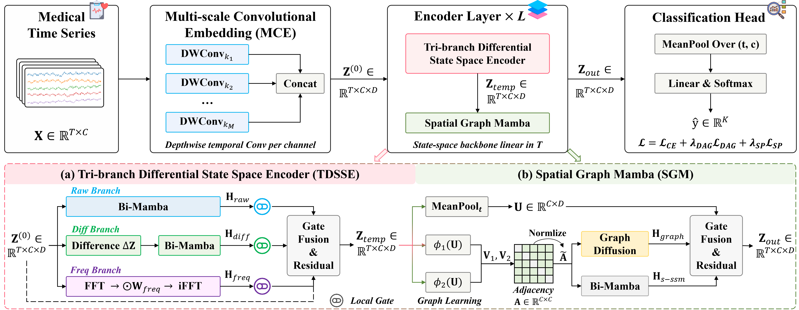
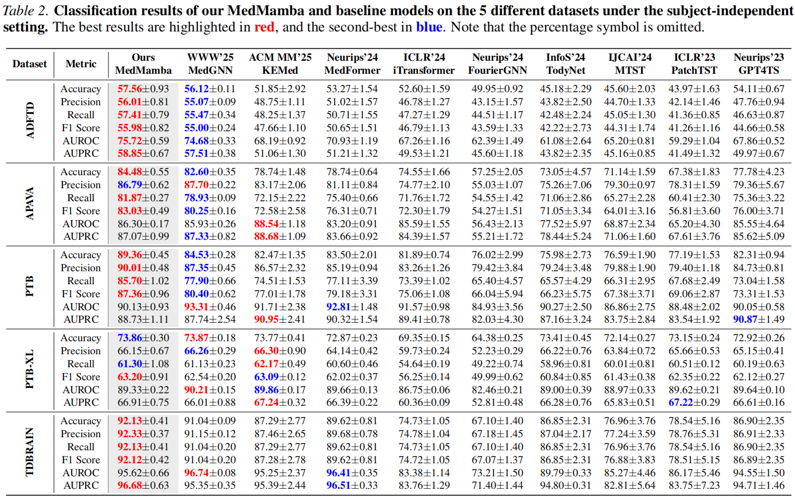

<div align="center">
<h1> MedMamba: Multi-View State Space Models with Adaptive Graph Learning for Medical Time Series Classification </h1>
</div>

Medical time series are central to healthcare, enabling continuous monitoring and supporting timely clinical decisions. Despite recent progress, existing methods often struggle to jointly model long-range temporal dynamics and cross-channel interactions efficiently, and their representations can be fragile under nonstationarities like baseline drift. To address these challenges, we propose **MedMamba**, an end-to-end architecture that integrates state space models with domain-specific inductive biases for medical time series classification. MedMamba first employs multi-scale convolutional embeddings across multiple receptive fields to capture local morphology. It then introduces a tri-branch differential state space encoder that simultaneously processes the raw signal, temporal differences, and frequency-domain views, fusing them via gated aggregation to emphasize informative patterns while suppressing drift. To model spatial dependencies, we design a spatial graph mamba module that learns a  directed dependency matrix regularized toward sparsity and acyclicity to capture channel topology without predefined graphs. Extensive experiments on five real-world datasets demonstrate that MedMamba achieves state-of-the-art performance while maintaining linear computational complexity, and ablation studies validate each component's contribution.

## Overview



## 1. Installation

```
conda create -n MedMamba python=3.8.10
conda activate MedMamba
pip install -r requirements.txt
```

## 2. Results



## 3. Dataset

All data can be accessed in [Medformer](https://github.com/DL4mHealth/Medformer).

```
├── ./dataset
    ├── [ADFTD]
    ├── [APAVA]
    ├── [PTB]
    ├── [TDBRAIN]
    ├── [PTB-XL]
```

## 4. Usage

**To train a model**

```
bash ./scripts/APAVA_Subject.sh
```

## Acknowledgements

Our code is largely based on [Medformer](https://github.com/DL4mHealth/Medformer) and [Time-Series-Library](https://github.com/thuml/Time-Series-Library). Thanks for these authors for their valuable work, hope our work can also contribute to related research.
